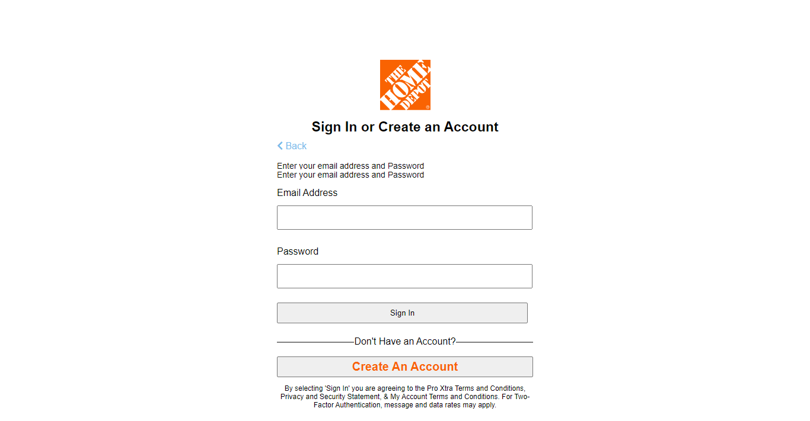
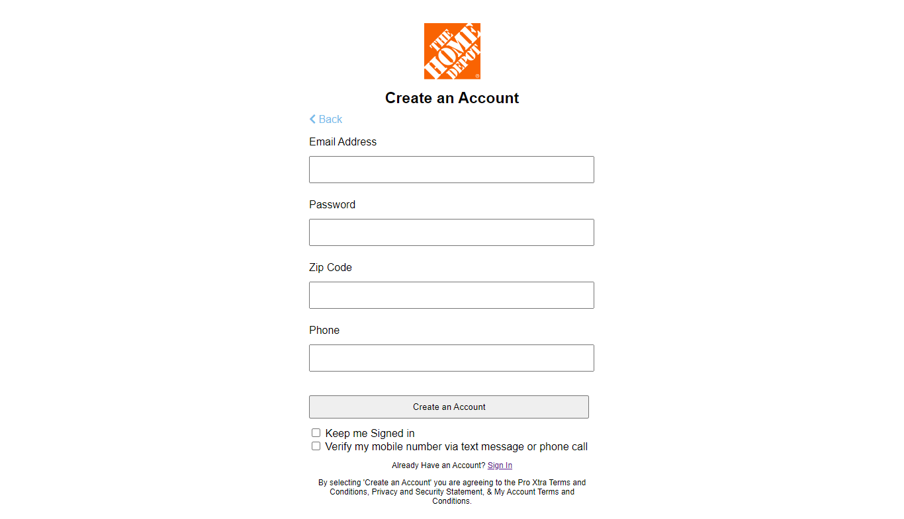
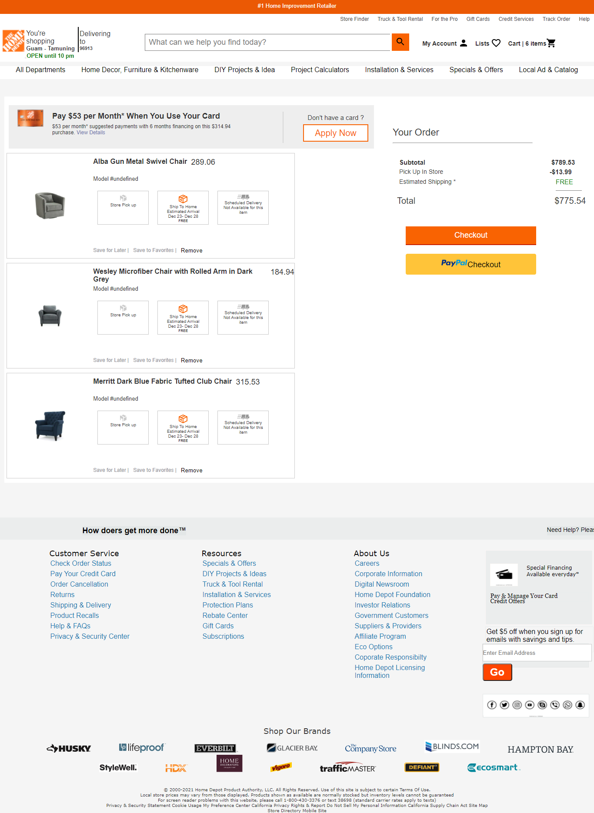
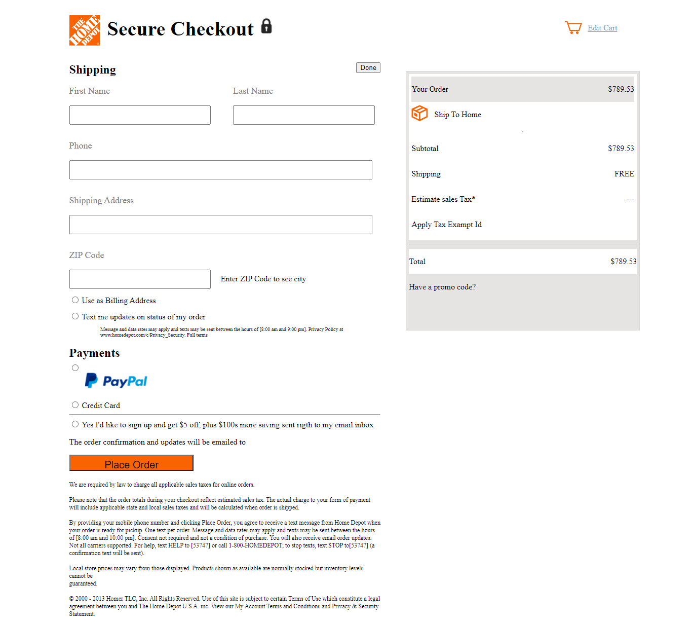

Home Depot, is the largest home improvement retailer in the United States, supplying tools, construction products, appliances, and services.

In this Project we made clone of The Home depot clone with our ability and strength in technolgy stack that we learned so far in the Masai School,we were able to clone the
frontend and backend of [Homedepot.com](https://www.homedepot.com/).This project is build as a part of masai school(30 weeks of boot camp) curriculam project and completed in a duration of 5 days with team of 4.

## Tech Stack
<!-- 
 -->
- HTML , CSS
- JAVASCRIPT
- Browser LocalStorage for Frontend
- MongoDB as Database
- Nodejs, Express , EJS for Backend
- [Heroku Deployment Link](https://thehomedepot.herokuapp.com/)
- [Blog Link](https://rajnarayana.hashnode.dev/the-home-depot-clone-with-backend)

## Installing and Running
<!-- 
 -->
To run this application on your local system, execute the following commands on your terminal/command line:
  
  <code>git clone https://github.com/drajnarayana/TheHomeDepot-Clone-Backend</code>
  
  <code>npm i</code> 
  
  <code>npm run server</code> 
  
  -create a .env file with username and password of mongodb
  
  To start using the application, open the <a href="https://thehomedepot.herokuapp.com/" target="_blank">[click here](https://thehomedepot.herokuapp.com/)</a> 
  
  ## Features 
<!-- --- -->
- User can Sigin and Registration functionality on home page.
- On product page particular category products with multiple sorting options displayed.
- Users can add multiple products to their cart with total price details.
- On Checkout page price is calculated dynamically.

## Steps to navigate the website:
<!-- 
 -->
- On the Landing Page header, user can click on the 'My Account' Icon to either Sign In or Rgeistration of an Account
- Once the user has logged in, they are taken back to the Landing Page.
- On the top nav-bar, the user can navigate to the following categories: `All Departments` or `Home Decor,Furniture`to open the products page

- On the Products Page 
  - On clicking on each product 'Add to Cart' button. Clicking on it, the user will be shown the details of the product.
  - Along with the option to add the product to their Cart and Continue Shopping button redirects to product page.

- On the Cart page
  - The user can remove a product from the cart.
  - The User can continue with Checkout and Paypal Checkout

- On Checkout page, the user is supposed to
  - Fill their First name, Last name ,Phone number Shipping address and Zip code
  - Select a Shipping Method
  - Enter their Credit/Debit card details or Paypal account
  - User can Place the Order or Edit the cart item on redirecting to cart page

## Screenshots
A glimpse of our website

**Home Page:**

**Signin Page:**

**Register Page:**

**Product Page:**

**Product Description Page:**

**Cart Page:**

**Checkout Page:**

## Authors
- [@Shyamal90](https://github.com/Shyamal90)
- [@drajnarayana](https://github.com/drajnarayana)
- [@app3200](https://github.com/app3200)
- [@Kajalkumari677](https://github.com/Kajalkumari677)

